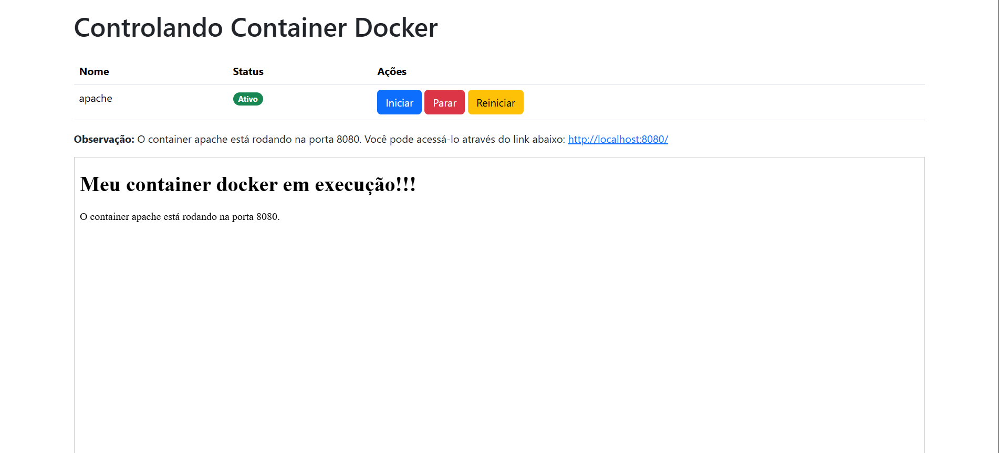
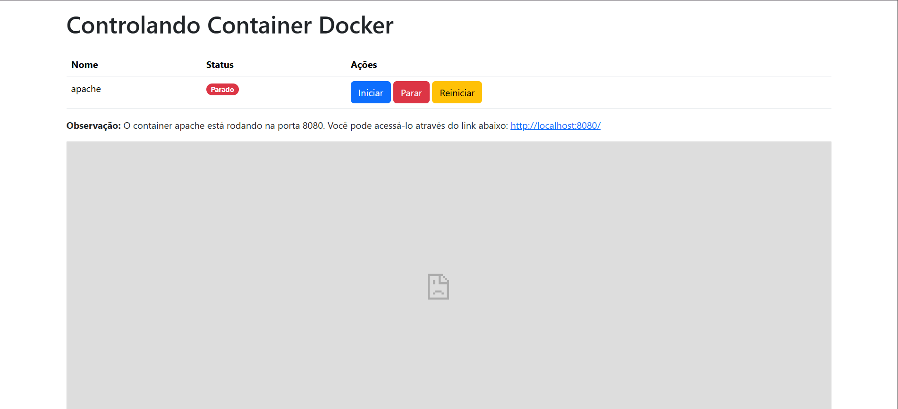

# GUI-CONTROLER-DOCKER

## Sobre o projeto

O projeto **GUI-CONTROLER-DOCKER** é uma aplicação com interface gráfica para controle de containers Docker. A aplicação permite iniciar, parar e reiniciar containers Docker por meio de uma API desenvolvida com Flask, e um frontend amigável para facilitar a administração.

*OBS: como primeira versão, é manipualdo apenas um container, sem possibilidade de criar, apenas utilizar o container de teste criado pelo docker-compose.yml.*

## Layout
## Em execução

## Parado


## Funcionalidades

-   Exibir o status do container
    
-   Iniciar container
    
-   Parar container
    
-   Reiniciar container
    
-   Interface gráfica para controle
    
-   Backend com Flask que executa comandos Docker
    
-   Sistema modular com frontend separado
    

## Tecnologias utilizadas

-   `Flask` (Python) para o backend
    
-   `Docker` para orquestração de containers
    
-   `HTML/JS` para o frontend
    
-   `Apache HTTPD` como serviço adicional simulado
    
-   `Docker Compose` para facilitar a organização dos serviços
    

## Estrutura de pastas

```
gui-controle-docker/
└── app.py             # Backend Flask
├── frontend/          # Frontend React
├── public-html/       # Conteúdo estático do Apache
│   └── index.html
├── docker-compose.yml
└── Dockerfile         # (Apache)
```

## Instalação

### Pré-requisitos

-   [Docker](https://www.docker.com/)
    
-   Docker Compose
    

### Passos

1.  Clone o repositório:
    
    
   ```
   git clone https://github.com/seu-usuario/gui-controle-docker.git
   cd gui-controle-docker
 ```
    
2.  Inicie os containers:
       
    ```
    docker-compose up --build
    ```
    
3.  Inicie o backend Flask (fora do Docker, manualmente):
    
 
    
    ```cd app
    python3 -m venv venv source venv/bin/activate
    pip install -r requirements.txt
    python app.py
    ```
    
## Executar o projeto

-   Backend Flask: acessível via `http://localhost:5000`
    
-   Frontend HTML/JS: acessível via `http://localhost:3000`
    
-   Apache: acessível via `http://localhost:8080`
    

## API

-   `POST /container/start` – Inicia um container
    
-   `POST /container/stop` – Para um container
    
-   `POST /container/restart` – Reinicia um container
    
-   `GET /container/status/<name>` – Retorna o status de um container
    

## Autor

Henrique Palermo Emerick